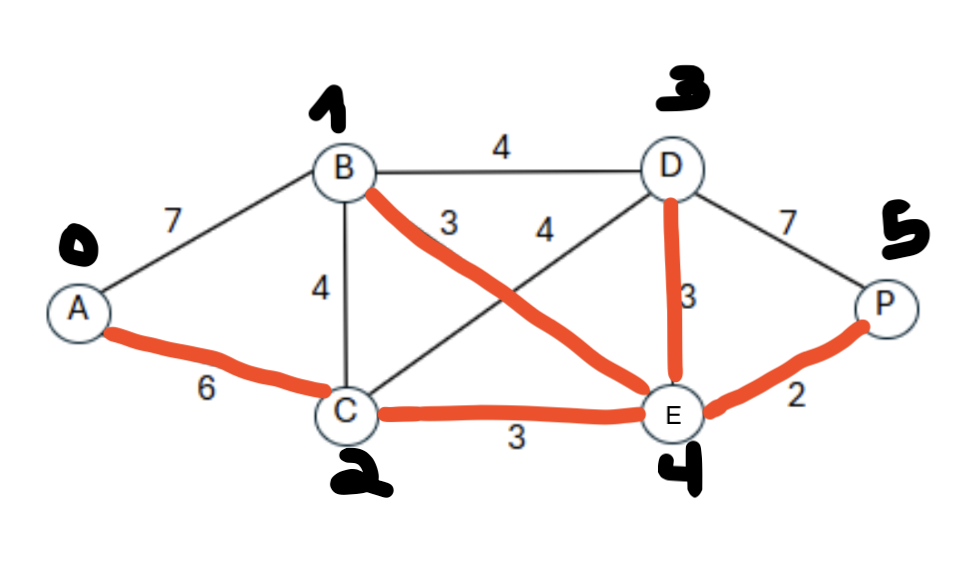

## Exercício Prático - Otimização 2 (P108)

Nesse repositório estão as implementações do problema da Árvore Geradora Mínima
por meio dos algoritmos de Kruskal e Prim.

No caso do grafo fornecido pelo exercício, os doois algoritmos encontram a mesma
Árvore:



### Executando

O código está focado no exemplo, mas aplicando algumas mudanças e melhorias ele
pode ser direcionado para qualquer tipo de grafo. Para executar o exemplo do exercício,
basta clonar o repositório e executar:

```python
python main.py
```

Com o exemplo do exercício, teremos a seguinte resposta:
```
====== KRUSKAL =====
Minimal cost: 17
Edges:
[Edge: from = 4, to = 5, weight = 2
[Edge: from = 1, to = 4, weight = 3
[Edge: from = 2, to = 4, weight = 3
[Edge: from = 3, to = 4, weight = 3
[Edge: from = 0, to = 2, weight = 6
====== PRIM =====
Minimal cost: 17
Edges:
[Edge: from = 0, to = 2, weight = 6
[Edge: from = 2, to = 4, weight = 3
[Edge: from = 4, to = 5, weight = 2
[Edge: from = 4, to = 1, weight = 3
[Edge: from = 4, to = 3, weight = 3
```
